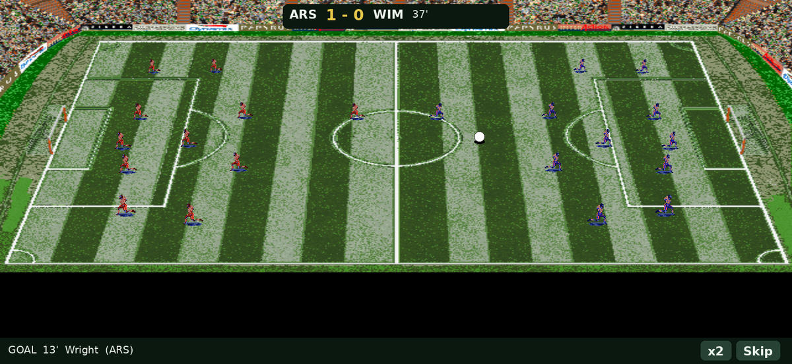

# USM2: Ultimate Soccer Manager 2, rebuilt for Android

A native Android (Kotlin / Jetpack Compose) reconstruction of the 1997 DOS
football-management classic **Ultimate Soccer Manager 2**, re-laid for touch.
It reuses the original game's real database (clubs, managers, players,
stadiums) and screen artwork, decoded from the original files.

## Download

**[⬇ Download the latest APK](https://github.com/Matswm86/USM2/releases/download/latest/usm2.apk)**

Sideload it on Android 8.0+ (enable "install unknown apps"). It is debug-signed,
so if you are updating over an older build with a different signature, uninstall
the old copy first.

*The match view, drawn from the original game's pitch art and player sprites.*

## What works today

It is a playable manager, not just a database browser:

- **Take charge of any club** and play a full season: a double round-robin
  fixture list, simulated results for the whole division each matchday, and a
  live league table with promotion / relegation zones.
- **Watchable matches** on the original pitch art: both teams placed in their
  real formation, the ball and players flowing with play, a ticking clock,
  scoreboard and goal ticker. The animated scoreline always matches the result
  the engine records.
- **Weather**: matches are played on dry, muddy, wet or frozen pitches
  (deterministic per fixture, cosmetic only), and **goalkeepers dive**.
- **Crowd audio** from the original game's own sounds: welcome, kick-off
  whistle, a roar when you score, a groan when you concede, full-time whistle.
- **Transfers & a living budget**: buy and sell from the office phone against a
  real balance that moves with wages, gate receipts and prize money.
- **Pick your starting XI** (a weaker eleven fields a weaker side), and make
  **substitutions during the match** (three per game; the clock pauses).
- **League browser**: England (Premier League down to the Conference), the
  European club pool, France and Germany. 412 clubs, 7,800+ players, with
  per-player attributes decoded from the original game.
- **Season rollover**: promotion, relegation and a fresh fixture list across a
  five-tier English pyramid.

## Roadmap

1. **Decode the original assets**: database and all screen artwork. ✅
2. **UI shell**: office, league/squad browser, player detail, transfers. ✅
3. **Match & management engine**: fixtures, tables, transfers, finances,
   manual line-up, season rollover, and an animated match view with weather,
   crowd audio and diving keepers. ✅
4. **More depth (optional):** AI clubs making their own transfers and wider
   playtest balancing.

## Building

APKs are built in CI (GitHub Actions), not locally. Push to `main` or run the
**Build Android APK** workflow; it produces `usm2.apk` as a workflow artifact
and updates the rolling `latest` release.

The Android project lives in [`android/`](android/) (`compileSdk 35`,
`minSdk 26`). The slim derived dataset and screen art it ships are committed
under `android/app/src/main/assets/`. The Python decoders that produced them
are in [`tools/`](tools/); the reverse-engineering notes are in
[`docs/FORMATS.md`](docs/FORMATS.md).

## Credits & legal

*Ultimate Soccer Manager 2* was created by Impressions Games and published by
Sierra in 1997. The game, its database and its artwork remain the property of
their respective rights holders. This project is a non-commercial fan
reconstruction for preservation and personal use, and is not affiliated with or
endorsed by the original creators. The original game program files are not
redistributed here.
